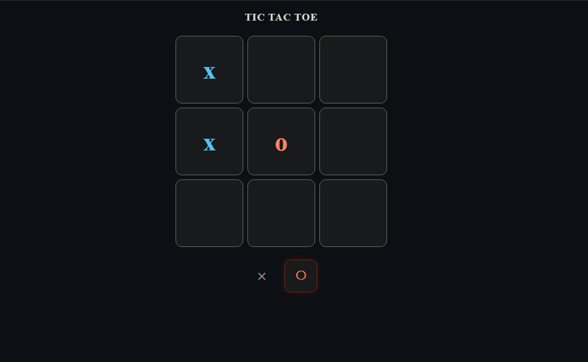

<div align="center">
  
</div>

<h1 align="center">Tic Tac Toe ✕ ◯</h1>

<p align="center">
  <strong>Juego clásico de Tres en Raya</strong> — construido con <em>React + Vite</em>
  <br />
  Diseño minimalista, tema oscuro, detección de ganador y empate.
</p>

<p align="center">
  
  
  
  
</p>

---

## 📋 Descripción

Tic Tac Toe es una implementación moderna del clásico juego de Tres en Raya desarrollada con **React 19** y **Vite 8**. El objetivo es sencillo: dos jugadores se turnan para colocar sus marcas (✕ y ◯) en un tablero de 3×3. El primero en alinear tres marcas en horizontal, vertical o diagonal gana.

---

## ✨ Características

- **Dos jugadores locales** — turnos alternados con indicador visual
- **Detección de ganador** — evalúa los 8 patrones de victoria
- **Detección de empate** — si todas las casillas están llenas sin ganador
- **Modal de resultado** — muestra quién ganó o si hubo empate
- **Reinicio rápido** — botón para comenzar una nueva partida
- **Animaciones** — transiciones suaves en celdas y modal
- **Tema oscuro** — diseño moderno con paleta de colores cuidada
- **Responsive** — adaptable a cualquier tamaño de pantalla

---

## 🛠️ Tecnologías

| Tecnología | Versión |
|------------|---------|
| [React](https://react.dev/) | 19.2 |
| [Vite](https://vite.dev/) | 8.0 |
| [ESLint](https://eslint.org/) | 10.2 |

---

## 🚀 Cómo ejecutar

```bash
# 1. Clonar el repositorio
git clone https://github.com/xc0d312/tictactoe.git
cd tictactoe

# 2. Instalar dependencias
npm install

# 3. Iniciar servidor de desarrollo
npm run dev
```

Abre [http://localhost:5173](http://localhost:5173) en tu navegador.

### Build para producción

```bash
npm run build    # genera carpeta dist/
npm run preview  # previsualiza el build
```

---

## 📁 Estructura del proyecto

```
tictactoe/
├── assets/
│   └── image.png            # Captura de pantalla
├── public/
│   ├── favicon.svg
│   └── icons.svg
├── src/
│   ├── assets/               # Recursos estáticos
│   ├── components/
│   │   ├── Square.jsx        # Celda individual del tablero
│   │   └── Winner.jsx        # Modal de resultado
│   ├── constants/
│   │   └── tictactoe.js      # Turnos y patrones de victoria
│   ├── style.css/
│   │   └── tictac.css        # Estilos del juego
│   ├── App.jsx               # Componente principal con la lógica del juego
│   └── main.jsx              # Punto de entrada
├── index.html
├── package.json
├── vite.config.js
└── README.md
```

---

## 🧠 Lógica del juego

El estado del tablero se maneja con un array de 9 posiciones (`useState`). En cada clic:

1. Se valida que la casilla esté vacía y no haya ganador
2. Se actualiza el array con la marca del turno actual
3. Se verifica si hay un ganador comparando contra los 8 patrones predefinidos
4. Si hay ganador, se muestra el modal; si no, se cambia el turno
5. Si todas las casillas están llenas sin ganador, se declara empate

```js
const patternsWinner = [
  [0, 1, 2], [3, 4, 5], [6, 7, 8],  // filas
  [0, 3, 6], [1, 4, 7], [2, 5, 8],  // columnas
  [0, 4, 8], [2, 4, 6]              // diagonales
];
```

---

## 👨‍💻 Autor

**Geovanny Cortez** — [@xc0d312](https://github.com/xc0d312)

[](https://github.com/xc0d312)

---

<p align="center">
  ⚡ Proyecto creado con fines de aprendizaje y práctica de React.
</p>
